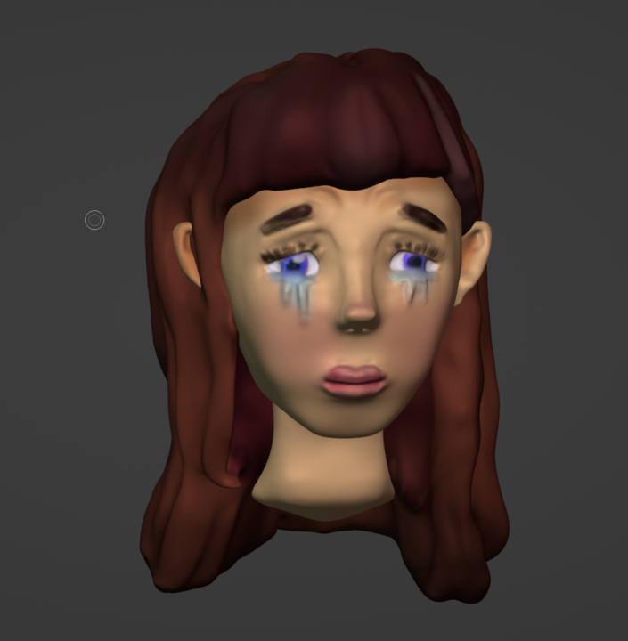

# BlenderCharacter
## Sketchfab Link:
https://skfb.ly/p7ZNB 

  
See Hourly Progress

## Hour 1

I started sculpting or the first proper time in blender. I started with the base shape of the head and then add some basic features.

### Progress:

## Hour 2

I added more expression to the face, added eyes then added tears to them and then I started the hair.

### Progress:

## Hour 3

I finished the sculpting of the hair. Then I painted the colors onto the face and hair.

### Progress:

